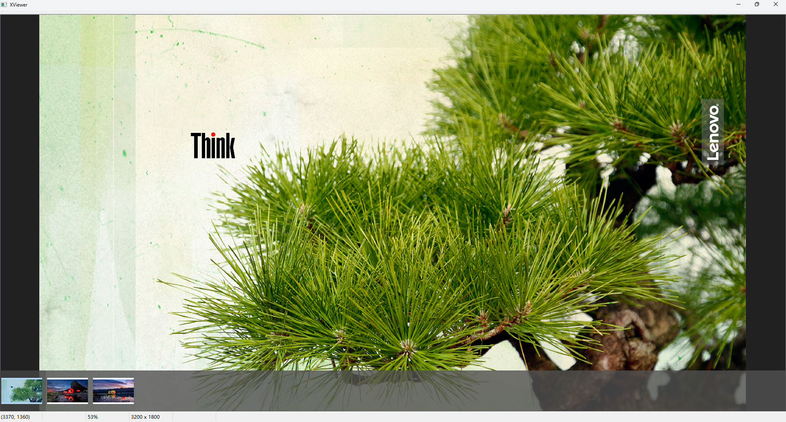
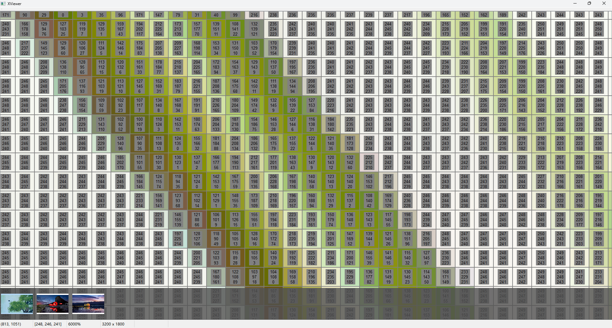
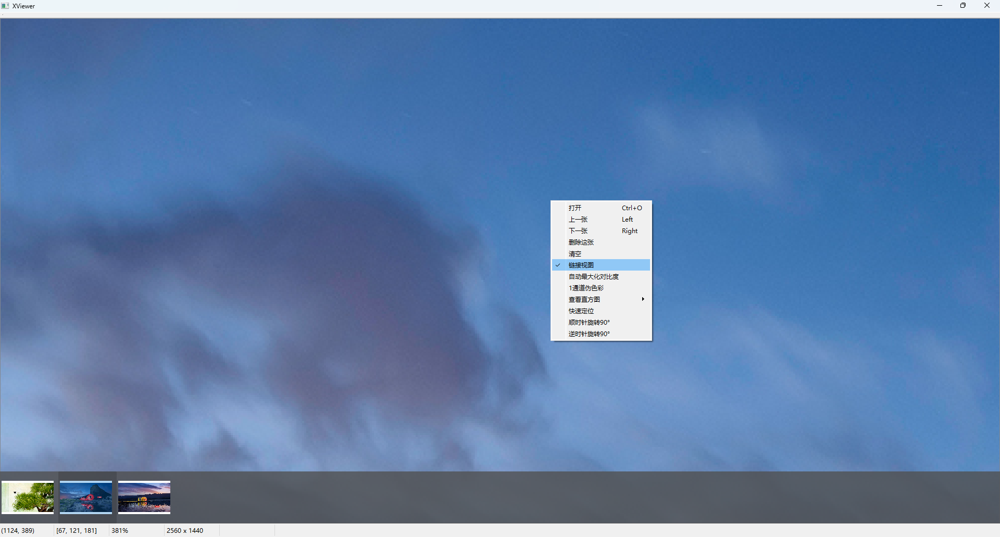

<div id="top">
<!-- HEADER STYLE: CLASSIC -->

<div align="center">
#IMAGEVIEWER

<em></em>

<!-- BADGES -->
<!-- local repository, no metadata badges. -->

<em>Built with the tools and technologies:</em>


</div>
<br>

---

## Table of Contents

- [Table of Contents](#table-of-contents)
- [Overview](#overview)
- [Features](#features)
- [Project Structure](#project-structure)
    - [Project Index](#project-index)
- [Getting Started](#getting-started)
    - [Prerequisites](#prerequisites)
    - [Installation](#installation)
    - [Usage](#usage)
    - [Testing](#testing)
- [Roadmap](#roadmap)
- [Contributing](#contributing)
- [License](#license)
- [Acknowledgments](#acknowledgments)

---

## Overview

**IMAGEVIEWER** 是一款轻量级图像查看工具，专为精确图像分析与像素级查看而设计。与普通看图软件不同，IMAGEVIEWER 最大的特色是支持将图像**无限放大直至每个像素方格清晰可见**，并能显示每个像素的精确数值，适用于图像处理、视觉算法开发、像素艺术等领域的用户。

本工具支持多种图像格式及像素模式，包括：

- **灰度图（Grayscale）**
- **RGB 彩色图**
- **RGBA 带透明通道图**

此外，还包含一系列增强视觉分析体验的特色功能：

1. **链接视图（Linked View）**：在切换同尺寸图像时，自动保持视图位置和缩放比例，便于对比调试。
2. **灰度图最大对比度显示**：动态拉伸灰度范围，增强细节可视性，适合暗部或高光信息观察。
3. **单通道伪彩色显示**：对灰度或单通道图像应用伪彩色渲染，提高特征辨识度。
4. ……

#### 图片显示

<div align="center">
  
  
</div>

#### 链接视图（linked view）

<div align="center">
  
  
</div>

---

## Features

<code>❯ REPLACE-ME</code>

---

## Project Structure

```sh
└── ImageViewer/
    ├── imageviewer.cpp
    ├── imageviewer.h
    ├── imageviewer.qrc
    ├── imageviewer.ui
    ├── ImageViewer.vcxproj
    ├── ImageViewer.vcxproj.filters
    ├── ImageViewer.vcxproj.user
    ├── main.cpp
    ├── PixmapItem.cpp
    ├── PixmapItem.h
    ├── Scene.cpp
    ├── Scene.h
    ├── test.bmp
    ├── View.cpp
    ├── View.h
    ├── x64
    │   └── Debug
    ├── xviewer.cpp
    ├── xviewer.h
    └── xviewer.ui
```

### Project Index

<details open>
	<summary><b><code>D:\CODE\IMAGEVIEWER\IMAGEVIEWER/</code></b></summary>
	<!-- __root__ Submodule -->
	<details>
		<summary><b>__root__</b></summary>
		<blockquote>
			<div class='directory-path' style='padding: 8px 0; color: #666;'>
				<code><b>⦿ __root__</b></code>
			<table style='width: 100%; border-collapse: collapse;'>
			<thead>
				<tr style='background-color: #f8f9fa;'>
					<th style='width: 30%; text-align: left; padding: 8px;'>File Name</th>
					<th style='text-align: left; padding: 8px;'>Summary</th>
				</tr>
			</thead>
				<tr style='border-bottom: 1px solid #eee;'>
					<td style='padding: 8px;'><b><a href='D:\code\ImageViewer\ImageViewer/blob/master/imageviewer.cpp'>imageviewer.cpp</a></b></td>
					<td style='padding: 8px;'>Code>❯ REPLACE-ME</code></td>
				</tr>
				<tr style='border-bottom: 1px solid #eee;'>
					<td style='padding: 8px;'><b><a href='D:\code\ImageViewer\ImageViewer/blob/master/imageviewer.h'>imageviewer.h</a></b></td>
					<td style='padding: 8px;'>Code>❯ REPLACE-ME</code></td>
				</tr>
				<tr style='border-bottom: 1px solid #eee;'>
					<td style='padding: 8px;'><b><a href='D:\code\ImageViewer\ImageViewer/blob/master/imageviewer.qrc'>imageviewer.qrc</a></b></td>
					<td style='padding: 8px;'>Code>❯ REPLACE-ME</code></td>
				</tr>
				<tr style='border-bottom: 1px solid #eee;'>
					<td style='padding: 8px;'><b><a href='D:\code\ImageViewer\ImageViewer/blob/master/imageviewer.ui'>imageviewer.ui</a></b></td>
					<td style='padding: 8px;'>Code>❯ REPLACE-ME</code></td>
				</tr>
				<tr style='border-bottom: 1px solid #eee;'>
					<td style='padding: 8px;'><b><a href='D:\code\ImageViewer\ImageViewer/blob/master/ImageViewer.vcxproj'>ImageViewer.vcxproj</a></b></td>
					<td style='padding: 8px;'>Code>❯ REPLACE-ME</code></td>
				</tr>
				<tr style='border-bottom: 1px solid #eee;'>
					<td style='padding: 8px;'><b><a href='D:\code\ImageViewer\ImageViewer/blob/master/ImageViewer.vcxproj.filters'>ImageViewer.vcxproj.filters</a></b></td>
					<td style='padding: 8px;'>Code>❯ REPLACE-ME</code></td>
				</tr>
				<tr style='border-bottom: 1px solid #eee;'>
					<td style='padding: 8px;'><b><a href='D:\code\ImageViewer\ImageViewer/blob/master/ImageViewer.vcxproj.user'>ImageViewer.vcxproj.user</a></b></td>
					<td style='padding: 8px;'>Code>❯ REPLACE-ME</code></td>
				</tr>
				<tr style='border-bottom: 1px solid #eee;'>
					<td style='padding: 8px;'><b><a href='D:\code\ImageViewer\ImageViewer/blob/master/main.cpp'>main.cpp</a></b></td>
					<td style='padding: 8px;'>Code>❯ REPLACE-ME</code></td>
				</tr>
				<tr style='border-bottom: 1px solid #eee;'>
					<td style='padding: 8px;'><b><a href='D:\code\ImageViewer\ImageViewer/blob/master/PixmapItem.cpp'>PixmapItem.cpp</a></b></td>
					<td style='padding: 8px;'>Code>❯ REPLACE-ME</code></td>
				</tr>
				<tr style='border-bottom: 1px solid #eee;'>
					<td style='padding: 8px;'><b><a href='D:\code\ImageViewer\ImageViewer/blob/master/PixmapItem.h'>PixmapItem.h</a></b></td>
					<td style='padding: 8px;'>Code>❯ REPLACE-ME</code></td>
				</tr>
				<tr style='border-bottom: 1px solid #eee;'>
					<td style='padding: 8px;'><b><a href='D:\code\ImageViewer\ImageViewer/blob/master/Scene.cpp'>Scene.cpp</a></b></td>
					<td style='padding: 8px;'>Code>❯ REPLACE-ME</code></td>
				</tr>
				<tr style='border-bottom: 1px solid #eee;'>
					<td style='padding: 8px;'><b><a href='D:\code\ImageViewer\ImageViewer/blob/master/Scene.h'>Scene.h</a></b></td>
					<td style='padding: 8px;'>Code>❯ REPLACE-ME</code></td>
				</tr>
				<tr style='border-bottom: 1px solid #eee;'>
					<td style='padding: 8px;'><b><a href='D:\code\ImageViewer\ImageViewer/blob/master/View.cpp'>View.cpp</a></b></td>
					<td style='padding: 8px;'>Code>❯ REPLACE-ME</code></td>
				</tr>
				<tr style='border-bottom: 1px solid #eee;'>
					<td style='padding: 8px;'><b><a href='D:\code\ImageViewer\ImageViewer/blob/master/View.h'>View.h</a></b></td>
					<td style='padding: 8px;'>Code>❯ REPLACE-ME</code></td>
				</tr>
				<tr style='border-bottom: 1px solid #eee;'>
					<td style='padding: 8px;'><b><a href='D:\code\ImageViewer\ImageViewer/blob/master/xviewer.cpp'>xviewer.cpp</a></b></td>
					<td style='padding: 8px;'>Code>❯ REPLACE-ME</code></td>
				</tr>
				<tr style='border-bottom: 1px solid #eee;'>
					<td style='padding: 8px;'><b><a href='D:\code\ImageViewer\ImageViewer/blob/master/xviewer.h'>xviewer.h</a></b></td>
					<td style='padding: 8px;'>Code>❯ REPLACE-ME</code></td>
				</tr>
				<tr style='border-bottom: 1px solid #eee;'>
					<td style='padding: 8px;'><b><a href='D:\code\ImageViewer\ImageViewer/blob/master/xviewer.ui'>xviewer.ui</a></b></td>
					<td style='padding: 8px;'>Code>❯ REPLACE-ME</code></td>
				</tr>
			</table>
		</blockquote>
	</details>
	<!-- x64 Submodule -->
	<details>
		<summary><b>x64</b></summary>
		<blockquote>
			<div class='directory-path' style='padding: 8px 0; color: #666;'>
				<code><b>⦿ x64</b></code>
			<!-- Debug Submodule -->
			<details>
				<summary><b>Debug</b></summary>
				<blockquote>
					<div class='directory-path' style='padding: 8px 0; color: #666;'>
						<code><b>⦿ x64.Debug</b></code>
					<table style='width: 100%; border-collapse: collapse;'>
					<thead>
						<tr style='background-color: #f8f9fa;'>
							<th style='width: 30%; text-align: left; padding: 8px;'>File Name</th>
							<th style='text-align: left; padding: 8px;'>Summary</th>
						</tr>
					</thead>
						<tr style='border-bottom: 1px solid #eee;'>
							<td style='padding: 8px;'><b><a href='D:\code\ImageViewer\ImageViewer/blob/master/x64\Debug\imageviewer.obj'>imageviewer.obj</a></b></td>
							<td style='padding: 8px;'>Code>❯ REPLACE-ME</code></td>
						</tr>
						<tr style='border-bottom: 1px solid #eee;'>
							<td style='padding: 8px;'><b><a href='D:\code\ImageViewer\ImageViewer/blob/master/x64\Debug\main.obj'>main.obj</a></b></td>
							<td style='padding: 8px;'>Code>❯ REPLACE-ME</code></td>
						</tr>
						<tr style='border-bottom: 1px solid #eee;'>
							<td style='padding: 8px;'><b><a href='D:\code\ImageViewer\ImageViewer/blob/master/x64\Debug\moc_imageviewer.obj'>moc_imageviewer.obj</a></b></td>
							<td style='padding: 8px;'>Code>❯ REPLACE-ME</code></td>
						</tr>
						<tr style='border-bottom: 1px solid #eee;'>
							<td style='padding: 8px;'><b><a href='D:\code\ImageViewer\ImageViewer/blob/master/x64\Debug\moc_Scene.obj'>moc_Scene.obj</a></b></td>
							<td style='padding: 8px;'>Code>❯ REPLACE-ME</code></td>
						</tr>
						<tr style='border-bottom: 1px solid #eee;'>
							<td style='padding: 8px;'><b><a href='D:\code\ImageViewer\ImageViewer/blob/master/x64\Debug\moc_View.obj'>moc_View.obj</a></b></td>
							<td style='padding: 8px;'>Code>❯ REPLACE-ME</code></td>
						</tr>
						<tr style='border-bottom: 1px solid #eee;'>
							<td style='padding: 8px;'><b><a href='D:\code\ImageViewer\ImageViewer/blob/master/x64\Debug\moc_xviewer.obj'>moc_xviewer.obj</a></b></td>
							<td style='padding: 8px;'>Code>❯ REPLACE-ME</code></td>
						</tr>
						<tr style='border-bottom: 1px solid #eee;'>
							<td style='padding: 8px;'><b><a href='D:\code\ImageViewer\ImageViewer/blob/master/x64\Debug\PixmapItem.obj'>PixmapItem.obj</a></b></td>
							<td style='padding: 8px;'>Code>❯ REPLACE-ME</code></td>
						</tr>
						<tr style='border-bottom: 1px solid #eee;'>
							<td style='padding: 8px;'><b><a href='D:\code\ImageViewer\ImageViewer/blob/master/x64\Debug\qrc_imageviewer.obj'>qrc_imageviewer.obj</a></b></td>
							<td style='padding: 8px;'>Code>❯ REPLACE-ME</code></td>
						</tr>
						<tr style='border-bottom: 1px solid #eee;'>
							<td style='padding: 8px;'><b><a href='D:\code\ImageViewer\ImageViewer/blob/master/x64\Debug\qt.natvis'>qt.natvis</a></b></td>
							<td style='padding: 8px;'>Code>❯ REPLACE-ME</code></td>
						</tr>
						<tr style='border-bottom: 1px solid #eee;'>
							<td style='padding: 8px;'><b><a href='D:\code\ImageViewer\ImageViewer/blob/master/x64\Debug\Scene.obj'>Scene.obj</a></b></td>
							<td style='padding: 8px;'>Code>❯ REPLACE-ME</code></td>
						</tr>
						<tr style='border-bottom: 1px solid #eee;'>
							<td style='padding: 8px;'><b><a href='D:\code\ImageViewer\ImageViewer/blob/master/x64\Debug\vc141.pdb'>vc141.pdb</a></b></td>
							<td style='padding: 8px;'>Code>❯ REPLACE-ME</code></td>
						</tr>
						<tr style='border-bottom: 1px solid #eee;'>
							<td style='padding: 8px;'><b><a href='D:\code\ImageViewer\ImageViewer/blob/master/x64\Debug\View.obj'>View.obj</a></b></td>
							<td style='padding: 8px;'>Code>❯ REPLACE-ME</code></td>
						</tr>
						<tr style='border-bottom: 1px solid #eee;'>
							<td style='padding: 8px;'><b><a href='D:\code\ImageViewer\ImageViewer/blob/master/x64\Debug\xviewer.obj'>xviewer.obj</a></b></td>
							<td style='padding: 8px;'>Code>❯ REPLACE-ME</code></td>
						</tr>
					</table>
					<!-- ImageViewer.tlog Submodule -->
					<details>
						<summary><b>ImageViewer.tlog</b></summary>
						<blockquote>
							<div class='directory-path' style='padding: 8px 0; color: #666;'>
								<code><b>⦿ x64.Debug.ImageViewer.tlog</b></code>
							<table style='width: 100%; border-collapse: collapse;'>
							<thead>
								<tr style='background-color: #f8f9fa;'>
									<th style='width: 30%; text-align: left; padding: 8px;'>File Name</th>
									<th style='text-align: left; padding: 8px;'>Summary</th>
								</tr>
							</thead>
								<tr style='border-bottom: 1px solid #eee;'>
									<td style='padding: 8px;'><b><a href='D:\code\ImageViewer\ImageViewer/blob/master/x64\Debug\ImageViewer.tlog\CL.command.1.tlog'>CL.command.1.tlog</a></b></td>
									<td style='padding: 8px;'>Code>❯ REPLACE-ME</code></td>
								</tr>
								<tr style='border-bottom: 1px solid #eee;'>
									<td style='padding: 8px;'><b><a href='D:\code\ImageViewer\ImageViewer/blob/master/x64\Debug\ImageViewer.tlog\CL.read.1.tlog'>CL.read.1.tlog</a></b></td>
									<td style='padding: 8px;'>Code>❯ REPLACE-ME</code></td>
								</tr>
								<tr style='border-bottom: 1px solid #eee;'>
									<td style='padding: 8px;'><b><a href='D:\code\ImageViewer\ImageViewer/blob/master/x64\Debug\ImageViewer.tlog\CL.write.1.tlog'>CL.write.1.tlog</a></b></td>
									<td style='padding: 8px;'>Code>❯ REPLACE-ME</code></td>
								</tr>
								<tr style='border-bottom: 1px solid #eee;'>
									<td style='padding: 8px;'><b><a href='D:\code\ImageViewer\ImageViewer/blob/master/x64\Debug\ImageViewer.tlog\ImageViewer.lastbuildstate'>ImageViewer.lastbuildstate</a></b></td>
									<td style='padding: 8px;'>Code>❯ REPLACE-ME</code></td>
								</tr>
								<tr style='border-bottom: 1px solid #eee;'>
									<td style='padding: 8px;'><b><a href='D:\code\ImageViewer\ImageViewer/blob/master/x64\Debug\ImageViewer.tlog\ImageViewer.write.1u.tlog'>ImageViewer.write.1u.tlog</a></b></td>
									<td style='padding: 8px;'>Code>❯ REPLACE-ME</code></td>
								</tr>
								<tr style='border-bottom: 1px solid #eee;'>
									<td style='padding: 8px;'><b><a href='D:\code\ImageViewer\ImageViewer/blob/master/x64\Debug\ImageViewer.tlog\link.15284.delete.1.tlog'>link.15284.delete.1.tlog</a></b></td>
									<td style='padding: 8px;'>Code>❯ REPLACE-ME</code></td>
								</tr>
								<tr style='border-bottom: 1px solid #eee;'>
									<td style='padding: 8px;'><b><a href='D:\code\ImageViewer\ImageViewer/blob/master/x64\Debug\ImageViewer.tlog\link.19132.delete.1.tlog'>link.19132.delete.1.tlog</a></b></td>
									<td style='padding: 8px;'>Code>❯ REPLACE-ME</code></td>
								</tr>
								<tr style='border-bottom: 1px solid #eee;'>
									<td style='padding: 8px;'><b><a href='D:\code\ImageViewer\ImageViewer/blob/master/x64\Debug\ImageViewer.tlog\link.28876.delete.1.tlog'>link.28876.delete.1.tlog</a></b></td>
									<td style='padding: 8px;'>Code>❯ REPLACE-ME</code></td>
								</tr>
								<tr style='border-bottom: 1px solid #eee;'>
									<td style='padding: 8px;'><b><a href='D:\code\ImageViewer\ImageViewer/blob/master/x64\Debug\ImageViewer.tlog\link.33096.delete.1.tlog'>link.33096.delete.1.tlog</a></b></td>
									<td style='padding: 8px;'>Code>❯ REPLACE-ME</code></td>
								</tr>
								<tr style='border-bottom: 1px solid #eee;'>
									<td style='padding: 8px;'><b><a href='D:\code\ImageViewer\ImageViewer/blob/master/x64\Debug\ImageViewer.tlog\link.command.1.tlog'>link.command.1.tlog</a></b></td>
									<td style='padding: 8px;'>Code>❯ REPLACE-ME</code></td>
								</tr>
								<tr style='border-bottom: 1px solid #eee;'>
									<td style='padding: 8px;'><b><a href='D:\code\ImageViewer\ImageViewer/blob/master/x64\Debug\ImageViewer.tlog\link.read.1.tlog'>link.read.1.tlog</a></b></td>
									<td style='padding: 8px;'>Code>❯ REPLACE-ME</code></td>
								</tr>
								<tr style='border-bottom: 1px solid #eee;'>
									<td style='padding: 8px;'><b><a href='D:\code\ImageViewer\ImageViewer/blob/master/x64\Debug\ImageViewer.tlog\link.write.1.tlog'>link.write.1.tlog</a></b></td>
									<td style='padding: 8px;'>Code>❯ REPLACE-ME</code></td>
								</tr>
								<tr style='border-bottom: 1px solid #eee;'>
									<td style='padding: 8px;'><b><a href='D:\code\ImageViewer\ImageViewer/blob/master/x64\Debug\ImageViewer.tlog\moc.read.1u.tlog'>moc.read.1u.tlog</a></b></td>
									<td style='padding: 8px;'>Code>❯ REPLACE-ME</code></td>
								</tr>
								<tr style='border-bottom: 1px solid #eee;'>
									<td style='padding: 8px;'><b><a href='D:\code\ImageViewer\ImageViewer/blob/master/x64\Debug\ImageViewer.tlog\moc.write.1u.tlog'>moc.write.1u.tlog</a></b></td>
									<td style='padding: 8px;'>Code>❯ REPLACE-ME</code></td>
								</tr>
								<tr style='border-bottom: 1px solid #eee;'>
									<td style='padding: 8px;'><b><a href='D:\code\ImageViewer\ImageViewer/blob/master/x64\Debug\ImageViewer.tlog\rcc.read.1u.tlog'>rcc.read.1u.tlog</a></b></td>
									<td style='padding: 8px;'>Code>❯ REPLACE-ME</code></td>
								</tr>
								<tr style='border-bottom: 1px solid #eee;'>
									<td style='padding: 8px;'><b><a href='D:\code\ImageViewer\ImageViewer/blob/master/x64\Debug\ImageViewer.tlog\rcc.write.1u.tlog'>rcc.write.1u.tlog</a></b></td>
									<td style='padding: 8px;'>Code>❯ REPLACE-ME</code></td>
								</tr>
								<tr style='border-bottom: 1px solid #eee;'>
									<td style='padding: 8px;'><b><a href='D:\code\ImageViewer\ImageViewer/blob/master/x64\Debug\ImageViewer.tlog\uic.read.1u.tlog'>uic.read.1u.tlog</a></b></td>
									<td style='padding: 8px;'>Code>❯ REPLACE-ME</code></td>
								</tr>
								<tr style='border-bottom: 1px solid #eee;'>
									<td style='padding: 8px;'><b><a href='D:\code\ImageViewer\ImageViewer/blob/master/x64\Debug\ImageViewer.tlog\uic.write.1u.tlog'>uic.write.1u.tlog</a></b></td>
									<td style='padding: 8px;'>Code>❯ REPLACE-ME</code></td>
								</tr>
							</table>
						</blockquote>
					</details>
					<!-- moc Submodule -->
					<details>
						<summary><b>moc</b></summary>
						<blockquote>
							<div class='directory-path' style='padding: 8px 0; color: #666;'>
								<code><b>⦿ x64.Debug.moc</b></code>
							<table style='width: 100%; border-collapse: collapse;'>
							<thead>
								<tr style='background-color: #f8f9fa;'>
									<th style='width: 30%; text-align: left; padding: 8px;'>File Name</th>
									<th style='text-align: left; padding: 8px;'>Summary</th>
								</tr>
							</thead>
								<tr style='border-bottom: 1px solid #eee;'>
									<td style='padding: 8px;'><b><a href='D:\code\ImageViewer\ImageViewer/blob/master/x64\Debug\moc\moc_imageviewer.cpp'>moc_imageviewer.cpp</a></b></td>
									<td style='padding: 8px;'>Code>❯ REPLACE-ME</code></td>
								</tr>
								<tr style='border-bottom: 1px solid #eee;'>
									<td style='padding: 8px;'><b><a href='D:\code\ImageViewer\ImageViewer/blob/master/x64\Debug\moc\moc_qtwidgetsclass.cpp'>moc_qtwidgetsclass.cpp</a></b></td>
									<td style='padding: 8px;'>Code>❯ REPLACE-ME</code></td>
								</tr>
								<tr style='border-bottom: 1px solid #eee;'>
									<td style='padding: 8px;'><b><a href='D:\code\ImageViewer\ImageViewer/blob/master/x64\Debug\moc\moc_Scene.cpp'>moc_Scene.cpp</a></b></td>
									<td style='padding: 8px;'>Code>❯ REPLACE-ME</code></td>
								</tr>
								<tr style='border-bottom: 1px solid #eee;'>
									<td style='padding: 8px;'><b><a href='D:\code\ImageViewer\ImageViewer/blob/master/x64\Debug\moc\moc_View.cpp'>moc_View.cpp</a></b></td>
									<td style='padding: 8px;'>Code>❯ REPLACE-ME</code></td>
								</tr>
								<tr style='border-bottom: 1px solid #eee;'>
									<td style='padding: 8px;'><b><a href='D:\code\ImageViewer\ImageViewer/blob/master/x64\Debug\moc\moc_xviewer.cpp'>moc_xviewer.cpp</a></b></td>
									<td style='padding: 8px;'>Code>❯ REPLACE-ME</code></td>
								</tr>
							</table>
						</blockquote>
					</details>
					<!-- qmake Submodule -->
					<details>
						<summary><b>qmake</b></summary>
						<blockquote>
							<div class='directory-path' style='padding: 8px 0; color: #666;'>
								<code><b>⦿ x64.Debug.qmake</b></code>
							<table style='width: 100%; border-collapse: collapse;'>
							<thead>
								<tr style='background-color: #f8f9fa;'>
									<th style='width: 30%; text-align: left; padding: 8px;'>File Name</th>
									<th style='text-align: left; padding: 8px;'>Summary</th>
								</tr>
							</thead>
								<tr style='border-bottom: 1px solid #eee;'>
									<td style='padding: 8px;'><b><a href='D:\code\ImageViewer\ImageViewer/blob/master/x64\Debug\qmake\qtvars_x64_Debug.props'>qtvars_x64_Debug.props</a></b></td>
									<td style='padding: 8px;'>Code>❯ REPLACE-ME</code></td>
								</tr>
							</table>
							<!-- temp Submodule -->
							<details>
								<summary><b>temp</b></summary>
								<blockquote>
									<div class='directory-path' style='padding: 8px 0; color: #666;'>
										<code><b>⦿ x64.Debug.qmake.temp</b></code>
									<table style='width: 100%; border-collapse: collapse;'>
									<thead>
										<tr style='background-color: #f8f9fa;'>
											<th style='width: 30%; text-align: left; padding: 8px;'>File Name</th>
											<th style='text-align: left; padding: 8px;'>Summary</th>
										</tr>
									</thead>
										<tr style='border-bottom: 1px solid #eee;'>
											<td style='padding: 8px;'><b><a href='D:\code\ImageViewer\ImageViewer/blob/master/x64\Debug\qmake\temp\.qmake.stash'>.qmake.stash</a></b></td>
											<td style='padding: 8px;'>Code>❯ REPLACE-ME</code></td>
										</tr>
										<tr style='border-bottom: 1px solid #eee;'>
											<td style='padding: 8px;'><b><a href='D:\code\ImageViewer\ImageViewer/blob/master/x64\Debug\qmake\temp\CCB6F971-444F-4B2E-9235-452A025734FC.ImageViewer.designtime.idx'>CCB6F971-444F-4B2E-9235-452A025734FC.ImageViewer.designtime.idx</a></b></td>
											<td style='padding: 8px;'>Code>❯ REPLACE-ME</code></td>
										</tr>
										<tr style='border-bottom: 1px solid #eee;'>
											<td style='padding: 8px;'><b><a href='D:\code\ImageViewer\ImageViewer/blob/master/x64\Debug\qmake\temp\moc_predefs.h.cbt'>moc_predefs.h.cbt</a></b></td>
											<td style='padding: 8px;'>Code>❯ REPLACE-ME</code></td>
										</tr>
										<tr style='border-bottom: 1px solid #eee;'>
											<td style='padding: 8px;'><b><a href='D:\code\ImageViewer\ImageViewer/blob/master/x64\Debug\qmake\temp\props.txt'>props.txt</a></b></td>
											<td style='padding: 8px;'>Code>❯ REPLACE-ME</code></td>
										</tr>
										<tr style='border-bottom: 1px solid #eee;'>
											<td style='padding: 8px;'><b><a href='D:\code\ImageViewer\ImageViewer/blob/master/x64\Debug\qmake\temp\qtvars.pro'>qtvars.pro</a></b></td>
											<td style='padding: 8px;'>Code>❯ REPLACE-ME</code></td>
										</tr>
										<tr style='border-bottom: 1px solid #eee;'>
											<td style='padding: 8px;'><b><a href='D:\code\ImageViewer\ImageViewer/blob/master/x64\Debug\qmake\temp\qtvars.vcxproj'>qtvars.vcxproj</a></b></td>
											<td style='padding: 8px;'>Code>❯ REPLACE-ME</code></td>
										</tr>
										<tr style='border-bottom: 1px solid #eee;'>
											<td style='padding: 8px;'><b><a href='D:\code\ImageViewer\ImageViewer/blob/master/x64\Debug\qmake\temp\qtvars.vcxproj.filters'>qtvars.vcxproj.filters</a></b></td>
											<td style='padding: 8px;'>Code>❯ REPLACE-ME</code></td>
										</tr>
										<tr style='border-bottom: 1px solid #eee;'>
											<td style='padding: 8px;'><b><a href='D:\code\ImageViewer\ImageViewer/blob/master/x64\Debug\qmake\temp\qtvars_x64_Debug.props'>qtvars_x64_Debug.props</a></b></td>
											<td style='padding: 8px;'>Code>❯ REPLACE-ME</code></td>
										</tr>
									</table>
								</blockquote>
							</details>
						</blockquote>
					</details>
					<!-- rcc Submodule -->
					<details>
						<summary><b>rcc</b></summary>
						<blockquote>
							<div class='directory-path' style='padding: 8px 0; color: #666;'>
								<code><b>⦿ x64.Debug.rcc</b></code>
							<table style='width: 100%; border-collapse: collapse;'>
							<thead>
								<tr style='background-color: #f8f9fa;'>
									<th style='width: 30%; text-align: left; padding: 8px;'>File Name</th>
									<th style='text-align: left; padding: 8px;'>Summary</th>
								</tr>
							</thead>
								<tr style='border-bottom: 1px solid #eee;'>
									<td style='padding: 8px;'><b><a href='D:\code\ImageViewer\ImageViewer/blob/master/x64\Debug\rcc\qrc_imageviewer.cpp'>qrc_imageviewer.cpp</a></b></td>
									<td style='padding: 8px;'>Code>❯ REPLACE-ME</code></td>
								</tr>
							</table>
						</blockquote>
					</details>
					<!-- uic Submodule -->
					<details>
						<summary><b>uic</b></summary>
						<blockquote>
							<div class='directory-path' style='padding: 8px 0; color: #666;'>
								<code><b>⦿ x64.Debug.uic</b></code>
							<table style='width: 100%; border-collapse: collapse;'>
							<thead>
								<tr style='background-color: #f8f9fa;'>
									<th style='width: 30%; text-align: left; padding: 8px;'>File Name</th>
									<th style='text-align: left; padding: 8px;'>Summary</th>
								</tr>
							</thead>
								<tr style='border-bottom: 1px solid #eee;'>
									<td style='padding: 8px;'><b><a href='D:\code\ImageViewer\ImageViewer/blob/master/x64\Debug\uic\ui_imageviewer.h'>ui_imageviewer.h</a></b></td>
									<td style='padding: 8px;'>Code>❯ REPLACE-ME</code></td>
								</tr>
								<tr style='border-bottom: 1px solid #eee;'>
									<td style='padding: 8px;'><b><a href='D:\code\ImageViewer\ImageViewer/blob/master/x64\Debug\uic\ui_qtwidgetsclass.h'>ui_qtwidgetsclass.h</a></b></td>
									<td style='padding: 8px;'>Code>❯ REPLACE-ME</code></td>
								</tr>
								<tr style='border-bottom: 1px solid #eee;'>
									<td style='padding: 8px;'><b><a href='D:\code\ImageViewer\ImageViewer/blob/master/x64\Debug\uic\ui_xviewer.h'>ui_xviewer.h</a></b></td>
									<td style='padding: 8px;'>Code>❯ REPLACE-ME</code></td>
								</tr>
							</table>
						</blockquote>
					</details>
				</blockquote>
			</details>
		</blockquote>
	</details>
</details>

---

## Getting Started

### Prerequisites

This project requires the following dependencies:

- **Programming Language:** unknown

### Installation

Build ImageViewer from the source and intsall dependencies:

1. **Clone the repository:**

    ```sh
    ❯ git clone ../ImageViewer
    ```

2. **Navigate to the project directory:**

    ```sh
    ❯ cd ImageViewer
    ```

3. **Install the dependencies:**

echo 'INSERT-INSTALL-COMMAND-HERE'

### Usage

Run the project with:

echo 'INSERT-RUN-COMMAND-HERE'

### Testing

Imageviewer uses the {__test_framework__} test framework. Run the test suite with:

echo 'INSERT-TEST-COMMAND-HERE'

---

## Roadmap

- [X] **`Task 1`**: <strike>Implement feature one.</strike>
- [ ] **`Task 2`**: Implement feature two.
- [ ] **`Task 3`**: Implement feature three.

---

## Contributing

- **💬 [Join the Discussions](https://LOCAL/ImageViewer/ImageViewer/discussions)**: Share your insights, provide feedback, or ask questions.
- **🐛 [Report Issues](https://LOCAL/ImageViewer/ImageViewer/issues)**: Submit bugs found or log feature requests for the `ImageViewer` project.
- **💡 [Submit Pull Requests](https://LOCAL/ImageViewer/ImageViewer/blob/main/CONTRIBUTING.md)**: Review open PRs, and submit your own PRs.

<details closed>
<summary>Contributing Guidelines</summary>

1. **Fork the Repository**: Start by forking the project repository to your LOCAL account.
2. **Clone Locally**: Clone the forked repository to your local machine using a git client.
   ```sh
   git clone https://github.com/XanHiaoo/ImageViewer.git
   ```
3. **Create a New Branch**: Always work on a new branch, giving it a descriptive name.
   ```sh
   git checkout -b new-feature-x
   ```
4. **Make Your Changes**: Develop and test your changes locally.
5. **Commit Your Changes**: Commit with a clear message describing your updates.
   ```sh
   git commit -m 'Implemented new feature x.'
   ```
6. **Push to LOCAL**: Push the changes to your forked repository.
   ```sh
   git push origin new-feature-x
   ```
7. **Submit a Pull Request**: Create a PR against the original project repository. Clearly describe the changes and their motivations.
8. **Review**: Once your PR is reviewed and approved, it will be merged into the main branch. Congratulations on your contribution!
</details>


---

## License

Imageviewer is protected under the [LICENSE](https://choosealicense.com/licenses) License. For more details, refer to the [LICENSE](https://choosealicense.com/licenses/) file.

---

## Acknowledgments

- Credit `contributors`, `inspiration`, `references`, etc.

<div align="right">
[![][back-to-top]](#top)

</div>


[back-to-top]: https://img.shields.io/badge/-BACK_TO_TOP-151515?style=flat-square


---
